# Easy-GetIn
Easy GetIn Android App

## 👥 Anggota Kelompok
```
Christopher Matthew Marvelio (00000043324)
Shyehan Rafael Adlinugroho (00000052738)
Dharma Hutama Husen (00000035891)
Bhakta Wachela Naidu (00000041722)
```

## 🚗 Easy GetIn
App: <https://play.google.com/store/apps/details?id=id.ac.umn.easygetin>

Github: <https://github.com/CMMhero/Easy-GetIn>

## 📱 Alur Pemakaian
User yang telah login dapat langsung masuk ke tampilan home aplikasi, sedangkan yang belum bisa melakukan proses register dan login terlebih dahulu. Pada aplikasi, terdapat beberapa page, yaitu home page, dimana user dapat mengorder/mengedit data mobil, order page untuk membuat order baru, lalu user dapat membatalkan order atau menyelesaikan order. Penyelesaian order akan dilakukan dan dilanjutkan melalui admin. History page berisi order yang telah seselsai, dan terakhir terdapat profile page untuk mengedit data mobil/logout.

## 📸 Screenshots

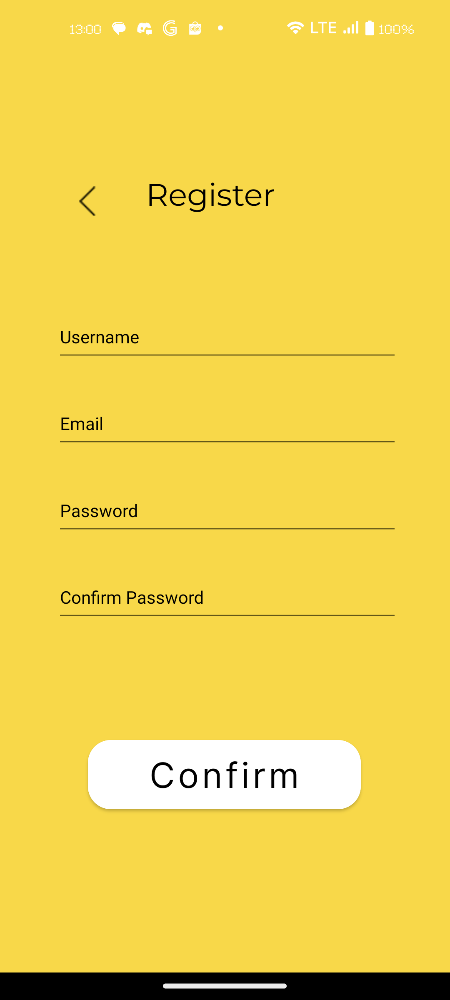
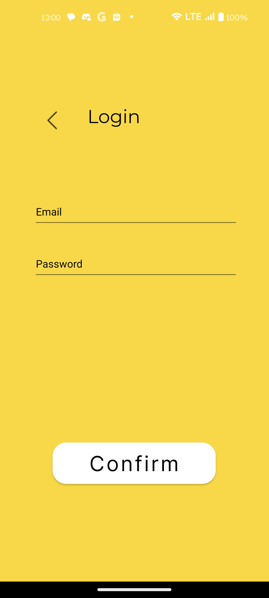
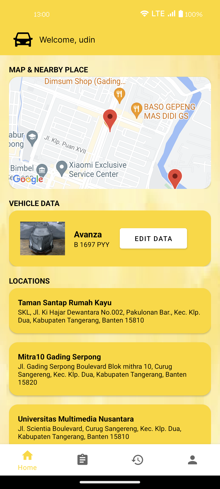
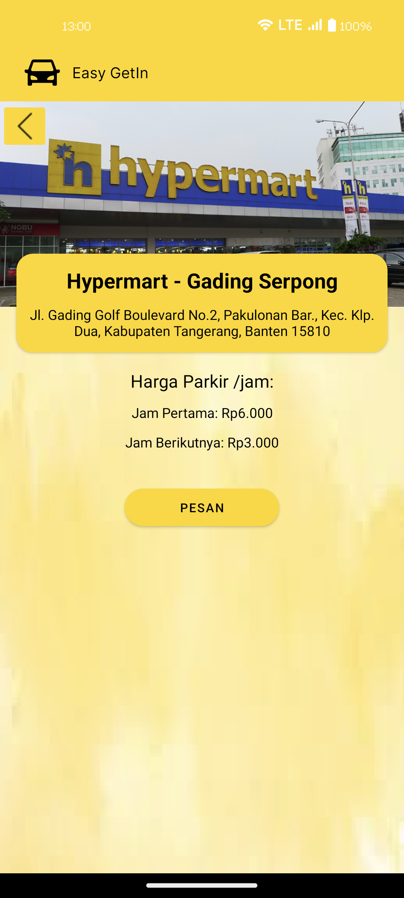
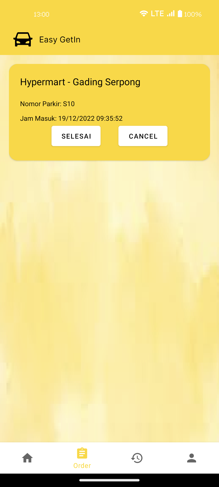
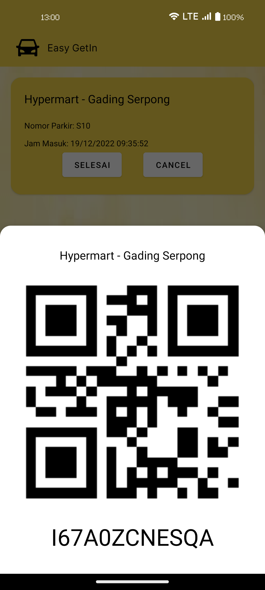
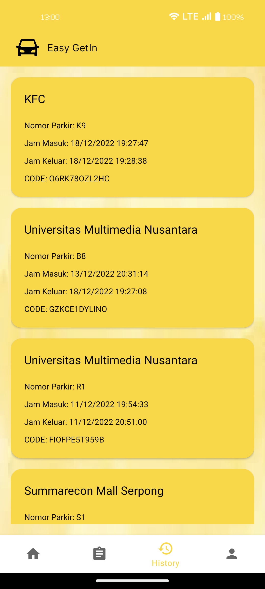

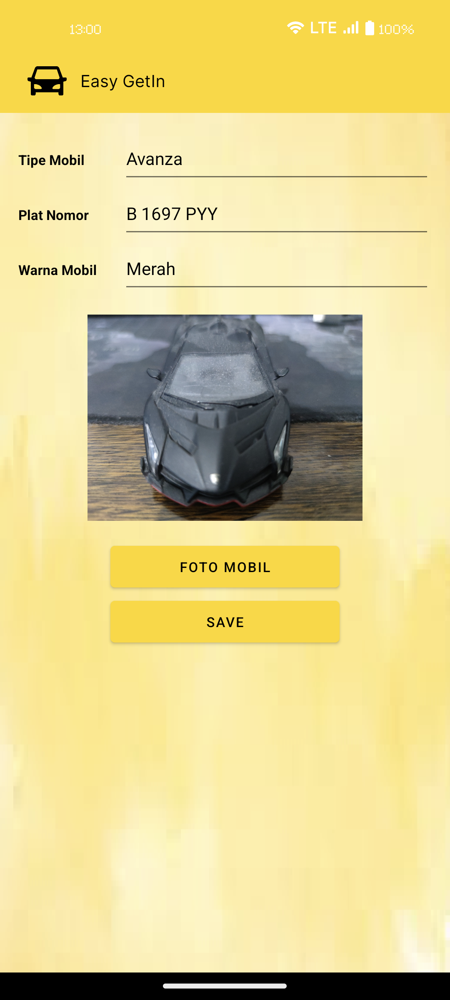
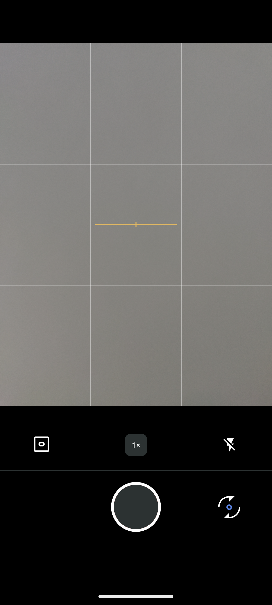
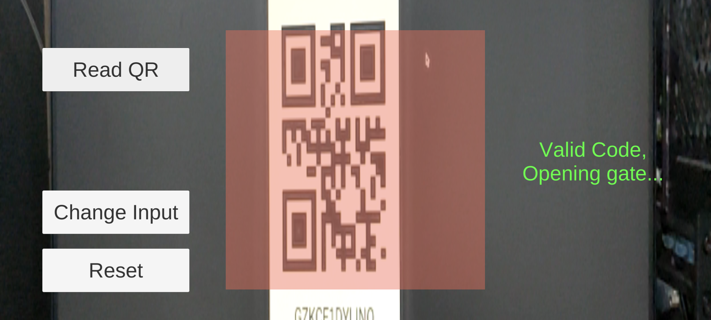
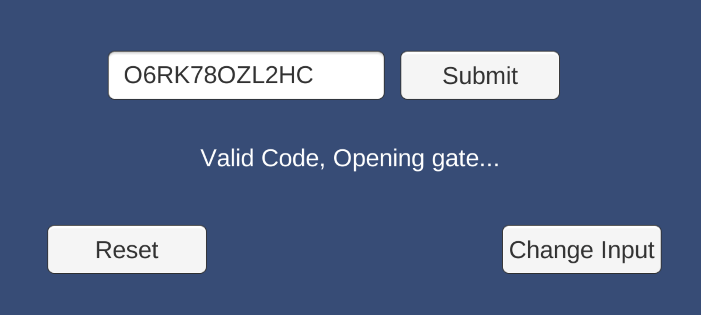
